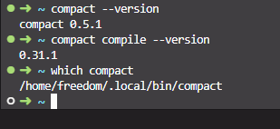
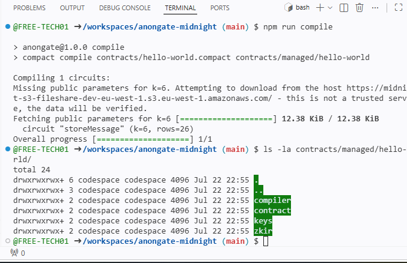
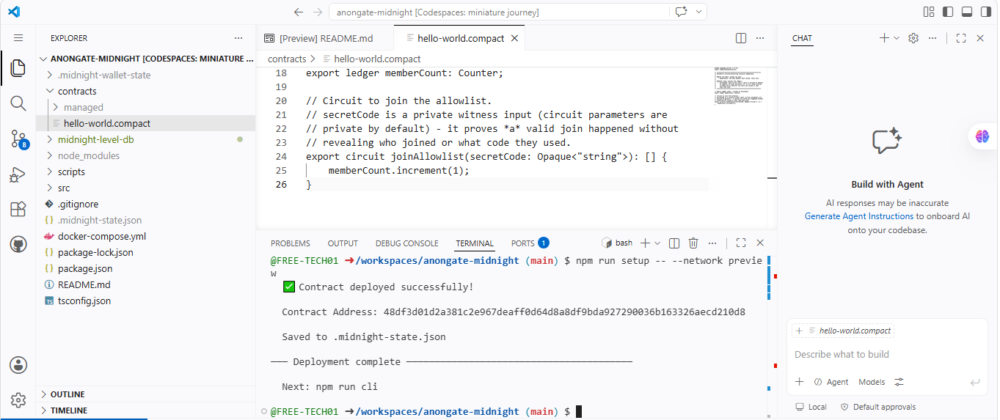

# AnonGate

> A privacy-preserving allowlist dApp for Midnight that lets a user prove membership without exposing their private input.

## Live Demo

[Deploy on Vercel and replace this placeholder with the live URL]

## Contract Address

| Network | Address |
|---------|---------|
| Preprod | `48df3d01d2a381c2e967deaff0d64d8a8df9bda927290036b163326aecd210d8` |
| Preview | `48df3d01d2a381c2e967deaff0d64d8a8df9bda927290036b163326aecd210d8` |

## What This Does

AnonGate is built for a concrete use case: a private alumni or community gate. A club admin can issue a private secret to trusted members, and those members can prove they belong without exposing the secret or their identity to the public ledger. In the browser, the app shows a clear split between what stays private in the local input field and what becomes visible on-chain as the public member counter.

## Privacy Model

- Public on-chain data: the `memberCount` ledger value.
- Private local data: the secret code entered into the browser before proof generation.
- What is proven without revealing: the user knows the correct secret, while the public counter increases to show successful activity.

## Privacy Claim

An observer can see that a membership proof was accepted and that the public counter increased, but they cannot see the private input or infer which secret was used.

## Tech Stack

Midnight Network, Compact, Midnight.js SDK, React/Vite, Lace wallet, Vitest

## Prerequisites

- Lace wallet installed
- Node.js 22+
- Docker Desktop or Docker Engine with Compose v2

## Run Locally

```bash
git clone <your-repo-url>
cd anongate-midnight
npm install
npm run dev
```

Then open the local Vite URL in your browser. The UI keeps the secret code private and never renders it in the public panel.

## Demo Video

[Record a short walkthrough and add the link here]

## Frontend Notes

The current frontend is intentionally simple and mobile-friendly. It includes:

- a Lace connect/disconnect flow with specific messages for missing wallet, cancellation, and network mismatch scenarios
- a private input field that stays local and is masked in the UI
- a public panel that shows only the observable counter and proof status
- a frontend privacy test covering the visible/private separation

## Quick Start

Requirements: Node 22, Docker (with Compose v2), and the Compact compiler at the version pinned in `.compact-version` at the create-mn-app repo root.

### Run the frontend

```bash
npm run dev
```

### Build the frontend for deployment

```bash
npm run build:frontend
```

### Contract workflow

```bash
npm install
npm run setup
npm run test:e2e
```

`npm run setup` runs end-to-end with no prompts:

1. `docker compose up -d --wait` starts the local Midnight devnet and health-checks the node, indexer, and proof server.
2. `npm run compile` compiles `contracts/hello-world.compact` to `contracts/managed/hello-world/`.
3. `npm run deploy` derives the wallet, funds it from the devnet preset, deploys the contract, and writes `.midnight-state.json`.

`npm run test:e2e` reconnects to the deployed contract and reads its ledger state.

## Local Devnet

The project ships its own devnet via `docker-compose.yml`:

| Service | Port | Purpose |
| --- | --- | --- |
| `node` | 9944 | Midnight node, `dev` chain preset |
| `indexer` | 8088 | GraphQL indexer for chain state |
| `proof-server` | 6300 | Generates ZK proofs for contract transactions |

Tear everything down with:

```bash
docker compose down -v
```

## Networks

This dApp supports three networks:

| Network | When to use |
| --- | --- |
| `undeployed` | Local devnet for development and testing |
| `preview` | Public preview testnet |
| `preprod` | Public preprod testnet |

Use `npm run network <name>` to switch networks, or `npm run setup -- --network <name>` to run the full flow for that network.

## Available Scripts

| Script | Description |
| --- | --- |
| `npm run setup` | One-shot: start devnet, compile, deploy |
| `npm run compile` | Compile the Compact contract |
| `npm run deploy` | Deploy the compiled contract |
| `npm run cli` | Interactive CLI to call circuits on the deployed contract |
| `npm run check-balance` | Print the wallet balances |
| `npm run dev` | Start the Vite frontend locally |
| `npm run build:frontend` | Build the Vite frontend for deployment |
| `npm run test:e2e` | Smoke + read-back check against the deployed contract |
| `npm run test:unit` | Run the frontend privacy tests |
| `npm run clean` | Remove generated contract and wallet state |

## Screenshots

**Compact toolchain installed:**


**Successful compile output:**


**Contract deployed to Preview:**

